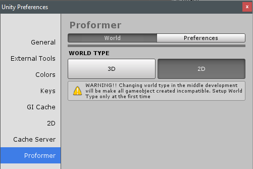

.. _doc_create_2d_game:

Create 2D Game
--------------

First make sure your World Settings is set as 2D

In this tutorial, I'm using `assets <http://opengameart.org/content/platform-pixel-art-assets>`_ (CC0)

.. toctree::
  :maxdepth: 1
  :caption: Step By Step
  :name: sec-stepbystep

  create_character_2d
  create_level
  create_enemy_follow_path
  create_enemy_ai
  add_gun_action
